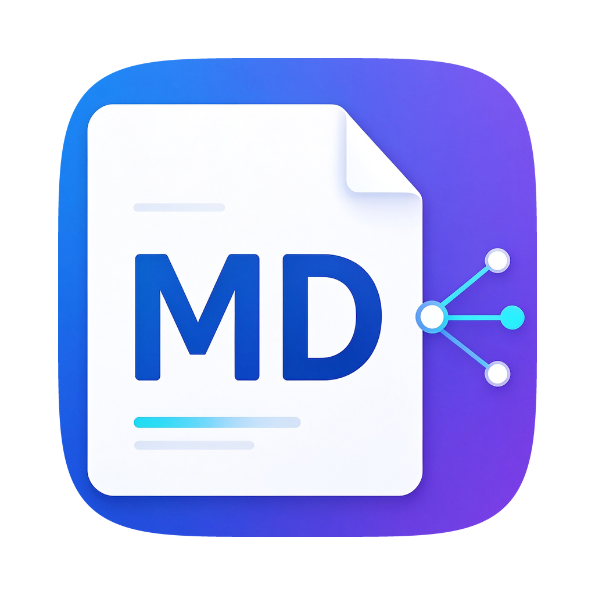
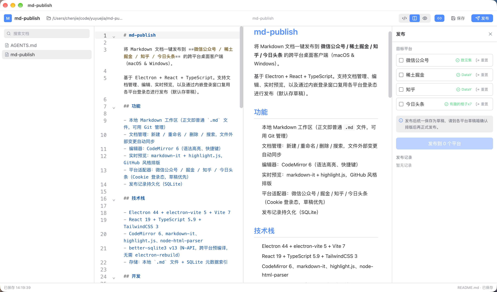

<p align="center">
  
</p>

<h1 align="center">md-publish</h1>

<p align="center">
  将 Markdown 文档一键发布到 <b>微信公众号 / 稀土掘金 / 知乎 / 今日头条</b> 的跨平台桌面客户端（macOS & Windows）。
</p>

<p align="center">
  <a href="http://md-publish.yuyuejia.com.cn">项目首页</a> ·
  <a href="#下载">下载</a> ·
  <a href="https://github.com/yuyuejia/md-publish/releases">Releases</a>
</p>



基于 Electron + React + TypeScript。支持文档管理、编辑、实时预览，以及通过内嵌登录窗口复用各平台登录态进行发布（默认存草稿）。

## 功能

- 本地 Markdown 工作区（正文即普通 `.md` 文件，可用 Git 管理）
- 文档管理：新建 / 重命名 / 删除 / 搜索，文件外部变更自动同步
- 编辑器：CodeMirror 6（语法高亮、快捷键）
- 实时预览：markdown-it + highlight.js，GitHub 风格排版
- 平台适配器：微信公众号 / 掘金 / 知乎 / 今日头条（Cookie 登录态，草稿优先）
- 发布记录持久化（SQLite）

## 下载

> 项目首页：<http://md-publish.yuyuejia.com.cn> 

| 平台 | 架构 | 安装包 |
| --- | --- | --- |
| macOS | Apple Silicon (arm64) | [md-publish-0.1.0-mac-arm64.dmg](http://md-publish.yuyuejia.com.cn/download/md-publish-0.1.0-mac-arm64.dmg) |
| macOS | Intel (x64) | [md-publish-0.1.0-mac-x64.dmg](http://md-publish.yuyuejia.com.cn/download/md-publish-0.1.0-mac-x64.dmg) |
| Windows | x64 | [md-publish-0.1.0-win-x64.exe](http://md-publish.yuyuejia.com.cn/download/md-publish-0.1.0-win-x64.exe) |
| Windows | arm64 | [md-publish-0.1.0-win-arm64.exe](http://md-publish.yuyuejia.com.cn/download/md-publish-0.1.0-win-arm64.exe) |


## 技术栈

- Electron 44 + electron-vite 5 + Vite 7
- React 19 + TypeScript 5.9 + TailwindCSS 3
- CodeMirror 6、markdown-it、highlight.js、node-html-parser
- better-sqlite3 v13（N-API，跨平台预编译，无需 electron-rebuild）
- 存储：本地 `.md` 文件 + SQLite 元数据索引

## 开发

```bash
npm install
npm run dev        # 启动开发模式
npm run typecheck  # 类型检查（main + renderer）
npm run lint       # ESLint
npm run build      # 构建
```

> **注意**：较新的 npm 默认会拦截第三方 install 脚本。若 `npm install` 后
> Electron 二进制缺失，请运行 `node node_modules/electron/install.js`，或执行
> 项目自带的 `npm run postinstall`。

## 打包

```bash
npm run pack:mac   # macOS dmg (arm64 + x64)
npm run pack:win   # Windows nsis (x64 + arm64)
```

发布流程通过 GitHub Actions（`.github/workflows/build.yml`）在各自平台分别构建。

## 目录结构

```
src/
  shared/     # 类型、IPC 契约、markdown 管线（main/renderer 共用）
  preload/    # contextBridge 暴露 window.api
  main/
    db/       # better-sqlite3 + 迁移
    fs/       # 工作区、文档 CRUD、文件监听
    markdown/ # 文章渲染、微信内联样式
    adapters/ # 平台适配器（base / session-manager / wechat / juejin / zhihu / toutiao）
    publish.ts
    ipc/
  renderer/   # React UI
build/        # 打包资源（entitlements、图标）
```

## 平台说明

| 平台 | 方式 | 说明 |
| --- | --- | --- |
| 微信公众号 | Cookie（`mp.weixin.qq.com` 后台 Web 接口） | 默认创建草稿，最终群发仍需人工确认；依赖后台内部接口，可能随改版失效 |
| 稀土掘金 | Cookie（`api.juejin.cn`） | 默认存草稿，可切换为直接发布 |
| 知乎 | Cookie（`zhuanlan.zhihu.com`） | **实验性**：接口风控较重，部分请求需要 `x-zse-96` 签名，可能失败 |
| 今日头条 | Cookie（`mp.toutiao.com`） | 默认保存草稿；使用 `X-CSRFToken`，正文 `<p>` 会补 `data-track`，图片上传头条图床 |

每个平台使用独立的 Electron `session` 分区（`persist:mdpublish-<id>`），登录态由 Chromium
加密持久化，互不干扰。平台适配器均为社区逆向实现，非官方 API，接口可能随时变化。

## License

Apache-2.0
